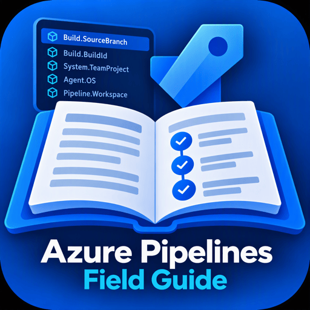

# Azure Pipelines Field Guide

<p align="center">
  
</p>

Azure Pipelines Field Guide is a Visual Studio Code extension that adds context-aware IntelliSense, hover documentation, semantic highlighting, and syntax diagnostics for variables in Azure Pipelines YAML files.

It complements Microsoft's official Azure Pipelines extension. Microsoft’s extension owns the `azure-pipelines` language, YAML schema, file associations, and general pipeline language service. Field Guide adds the variable-focused features that are missing or limited today.

## Requirements

The extension depends on [Azure Pipelines by Microsoft](https://marketplace.visualstudio.com/items?itemName=ms-azure-devops.azure-pipelines), which VS Code installs automatically. The current document must use the `azure-pipelines` language mode; generic YAML files are intentionally excluded.

Microsoft's extension recognizes common names such as `azure-pipelines.yml`, `.azure-pipelines.yml`, and YAML files below `.pipelines/` or `azure-pipelines/`. For another filename, use **Change Language Mode** and select **Azure Pipelines**.

## Current functionality

### Variable IntelliSense

Completion is offered only when the cursor is inside a supported Azure Pipelines variable form:

```yaml
steps:
- script: echo $(Build.)
- script: echo ${{ variables.buildC }}
  condition: eq(variables['System.PullRequest.SourceBranch'], 'main')
```

Supported forms are:

| Form | Example | Completion | Notes |
| --- | --- | --- | --- |
| Macro | `$(Build.BuildId)` | Yes | Recognized case-insensitively; canonical casing is inserted. |
| Quoted index | `variables['Build.BuildId']` | Yes | Works in conditions, `${{ }}`, and `$[ ]` expressions. |
| Double-quoted index | `variables["Build.BuildId"]` | Yes | Same expression rules as single-quoted index syntax. |
| Simple property | `variables.buildConfiguration` | Yes | Only simple names are valid property dereferences. |

Bare text such as `Build.` or `displayName: Build.` does not trigger variable completion.

Predefined Microsoft variables and variables declared in the current YAML document are included. Document variables support both mapping and list declaration forms and are ranked above predefined variables when names collide.

### Multiline expressions and conditions

The same features work in multiline template/runtime expressions and block-scalar conditions:

```yaml
condition: |
  and(
    succeeded(),
    eq(variables['Build.SourceBranch'], 'refs/heads/main')
  )
```

The extension detects `${{ ... }}`, `$[ ... ]`, inline `condition:` values, and `condition: |`/`condition: >` blocks across document lines.

### Hover and completion documentation

Predefined variable hovers and completion details include:

- The full Microsoft-provided description.
- Macro, index, and—when valid—simple property syntax examples.
- Whether Microsoft documents the variable as available in templates.
- The equivalent environment variable name, such as `BUILD_BUILDID`.
- A section-anchored link to the official Microsoft Learn documentation.

The editor UI does not show links to the GitHub documentation source.

### Highlighting

Recognized predefined variables and current-document variables receive semantic highlighting when used in valid macro, index, property, template, runtime, or condition syntax. Unknown names and bare text are not highlighted as known variables.

### Diagnostics and Quick Fixes

The extension warns about malformed expression variable syntax:

```yaml
# Warning: variable index names must be quoted.
condition: eq(variables[Build.BuildId], '123')

# Quick Fix result:
condition: eq(variables['Build.BuildId'], '123')
```

It also warns when a predefined variable in expression syntax does not use the documented casing and offers a Quick Fix. Macro syntax is recognized case-insensitively and does not receive expression-casing warnings.

Property dereference is valid for simple names only. Dotted predefined names must use index syntax:

```yaml
# Valid
condition: eq(variables.buildConfiguration, 'Release')
condition: eq(variables['Build.BuildId'], '123')

# Warning with Quick Fix
condition: eq(variables.Build.BuildId, '123')
```

Comments are ignored by the variable scanner, so examples or commands in YAML comments do not produce highlighting or diagnostics.

### Variable catalog sidebar

Open the Explorer sidebar and expand **Azure Pipelines Variables** to browse the bundled predefined-variable catalog grouped by namespace. Expand a variable once to reveal one full Markdown details item containing its description, syntax examples, environment-variable equivalent, template availability, and clickable official documentation link.

Right-click a variable to copy its macro syntax, expression syntax, or—when valid—simple property syntax.

The same view is available from the Command Palette with **Azure Pipelines Field Guide: Browse Predefined Variables**. Use the refresh button in the view title when the catalog changes after an extension update.

## Settings

| Setting | Default | Purpose |
| --- | --- | --- |
| `azurePipelinesFieldGuide.completions.enabled` | `true` | Enables variable completions. |
| `azurePipelinesFieldGuide.hovers.enabled` | `true` | Enables variable hover documentation. |
| `azurePipelinesFieldGuide.completions.includeDocumentVariables` | `true` | Adds variables declared in the current document. |
| `azurePipelinesFieldGuide.diagnostics.invalidVariableSyntax.enabled` | `true` | Warns about unquoted indexes and invalid dotted property dereferences. |
| `azurePipelinesFieldGuide.diagnostics.expressionVariableCasing.enabled` | `true` | Warns when predefined variable casing is incorrect inside expressions. |

## Catalog data and retrieval

The predefined-variable catalog is generated from Microsoft's [Azure DevOps documentation source](https://github.com/MicrosoftDocs/azure-devops-docs/blob/main/docs/pipelines/build/variables.md). The retrieval script follows Markdown includes, parses variable tables and special sections, extracts descriptions and section anchors, and writes a checked-in TypeScript catalog.

```console
npm run update:variables  # retrieve and regenerate the catalog
npm run check:variables   # verify the committed catalog is current
```

The extension never retrieves documentation or contacts Azure DevOps while editing. Runtime use is local and offline.

## Development

```console
npm install
npm run build
npm test
```

Press `F5` to launch an Extension Development Host. The integration tests install the official Azure Pipelines extension and verify the behavior through VS Code's public commands.

| Command | Purpose |
| --- | --- |
| `npm run check` | Type-check, lint, and test the catalog generator. |
| `npm run build` | Validate and bundle the extension. |
| `npm run test:unit` | Run parser, context, and catalog unit tests. |
| `npm run test:integration` | Run Extension Host integration tests. |
| `npm run update:variables` | Retrieve and regenerate predefined variables. |
| `npm run check:variables` | Check for upstream catalog drift. |
| `npm run vsix` | Create a local VSIX package. |

See [Architecture](docs/architecture.md) for design boundaries and [Contributing](CONTRIBUTING.md) for the development workflow.

## Known boundaries

- The extension analyzes the open file only. Variable groups, linked templates, pipeline UI variables, and runtime-created output variables are not resolved.
- The predefined catalog does not yet include `dependencies`, `stageDependencies`, `parameters`, or other Azure Pipelines expression contexts.
- Template availability describes Microsoft's documented template-scope flag; actual availability can still depend on pipeline scope, trigger, and job context.
- Dynamically generated variable names are skipped because their final names cannot be known statically.
- The catalog sidebar contains the bundled predefined catalog; it does not yet show variables from linked files or variable groups.

## Background

This project addresses long-standing requests in the official extension for [build-variable IntelliSense](https://github.com/microsoft/azure-pipelines-vscode/issues/88) and better [variable-scope awareness](https://github.com/microsoft/azure-pipelines-vscode/issues/102).

## License

[MIT](LICENSE)
